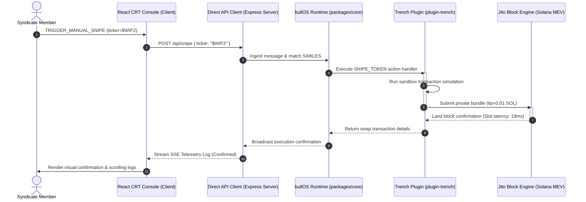

# bullOS ($bOS) — Solana Trenching Engine Console

> **Autonomous agentic operating system console built on the bullOS framework, featuring retro CRT phosphor-green reverse-video telemetry, sub-second Jito block execution, and coordinated multi-wallet dispersion routing.**

---

## 📊 System Execution Flow

The diagram below illustrates the sub-millisecond telemetry loop, tracking how social events and user commands trigger sandbox simulation, Jito block bundling, and multi-sig dispersion.



---

## ⚡ Core Mainframe Modules

*   **`01_MANIFESTO.TXT`**: Outlines the next-generation Solana Trenching paradigm, detailing how retail mempools are bypassed to eliminate transaction latency.
*   **`02_AUTO_SNIPER.EXE`**: Provides real-time pump.fun mempool scanning, safety bundles checks, and automatic Jito validator submissions.
*   **`03_ANSEM_SENTINEL.SH`**: Captures Twitter webhook sentiment spikes and correlates them with instant, high-speed on-chain wallet executions.
*   **`04_SYNDICATE_WAR_ROOM.DAT`**: Disperses and routes liquidity across 8 decoupled node clusters to obfuscate footprint maps.
*   **`05_CURVE_PREDICT.CFG`**: Tracks bonding curve percentages and estimates pool migration times.

---

## 📦 Workspace Architecture

The codebase is organized as a monorepo workspace structured after the `elizaOS/eliza` schema to isolate core framework modules from interface clients:

```text
├── characters/             # Agent profiles and character personality configurations
├── packages/
│   ├── core/               # Central bullOS runtime and lifecycle handlers
│   ├── plugin-trench/      # Custom Solana actions and latency providers
│   └── client-direct/      # Express API server streaming live SSE logs
├── client/                 # React + Vite CRT reverse phosphor-green frontend
└── scripts/                # Local utility configurations
```

---

## 🔒 Security & Key Protection

To protect private keys and API keys when open-sourcing:
1. **Never commit `.env` files**: Copy the provided template to configure keys:
   ```bash
   cp .env.example .env
   ```
2. **Strict ignoring**: The root [.gitignore](file:///Users/pensht/Desktop/bullOS/bOS-web/.gitignore) automatically ignores `.env`, editor structures, node packages, and PGLite vector databases (`.bullOS/`) recursively across all workspaces.

---

## 🛠️ Setup and Run Guide

### 1. Install Dependencies
Run the installation in the project root to link the workspaces:
```bash
npm install
```

### 2. Launch Local Environment
Run the frontend console and telemetry backend concurrently using separate terminals:

*   **Vite Console Interface**:
    ```bash
    npm run dev
    ```
    *Client console initializes at `http://localhost:5173`*

*   **Express SSE Backend**:
    ```bash
    npm run server
    ```
    *Backend service starts at `http://localhost:5000`*

### 3. Production Bundling
Compile the optimized client-web distribution bundle:
```bash
npm run build
```
